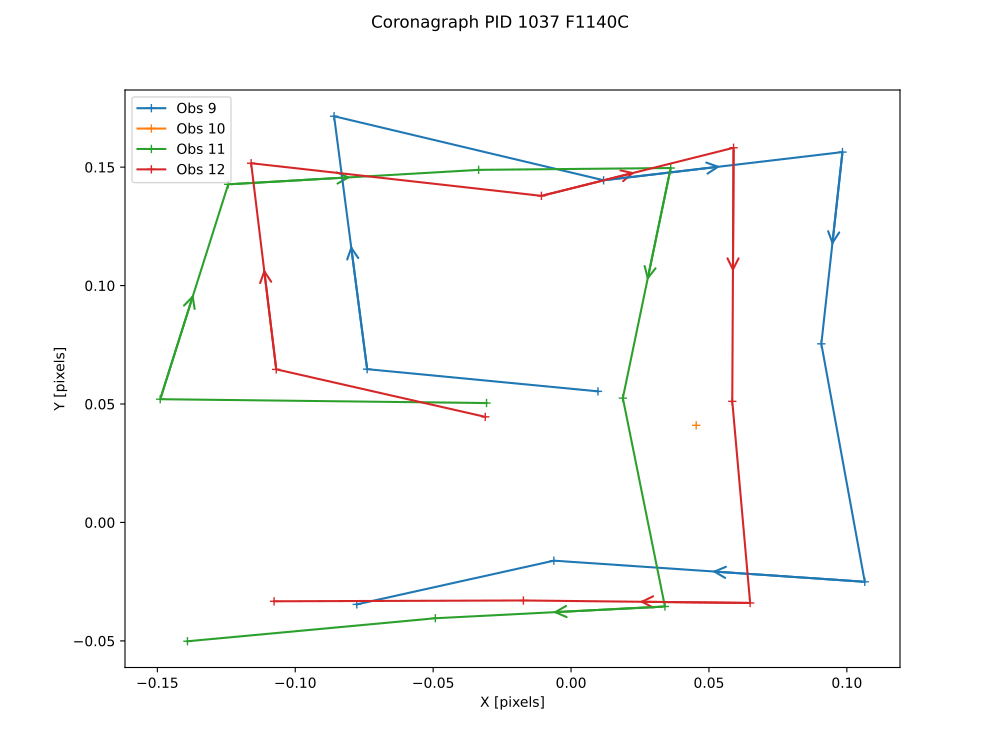
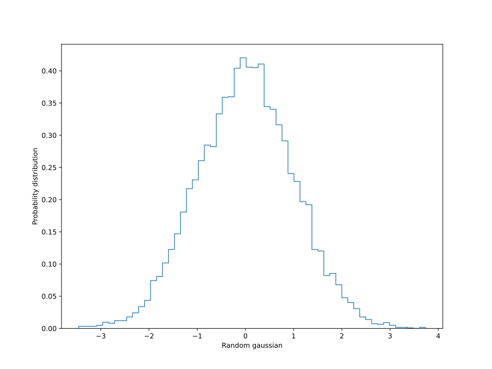
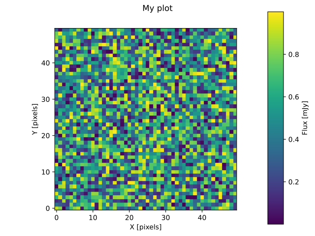
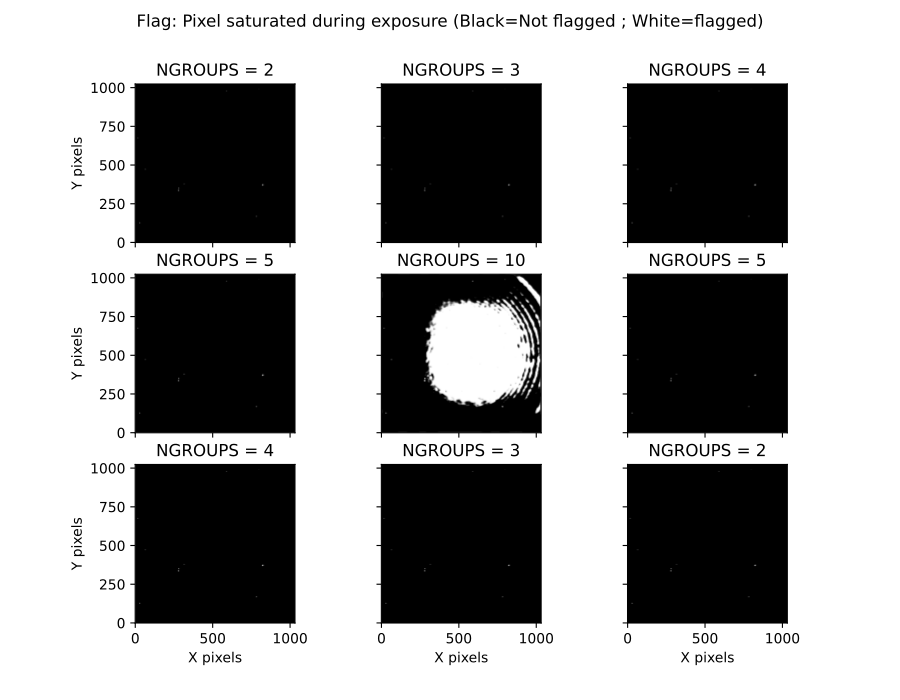
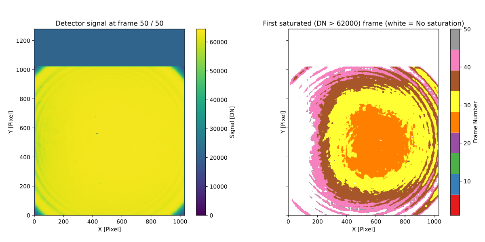
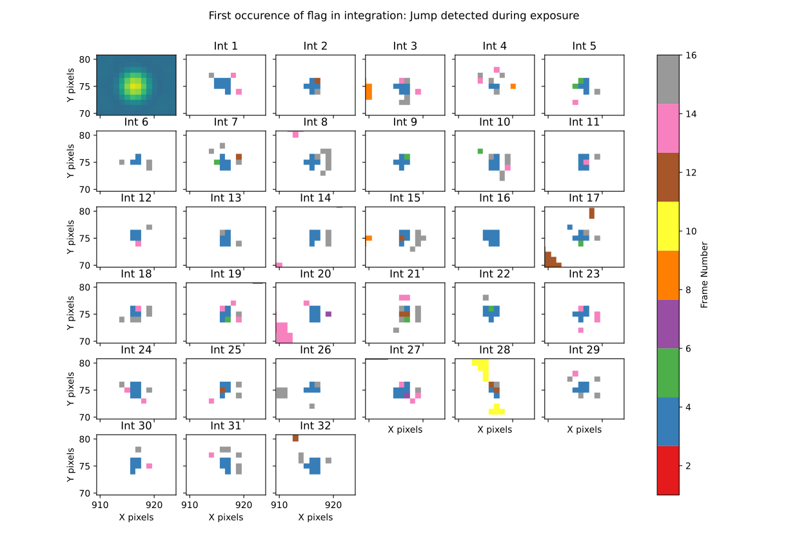
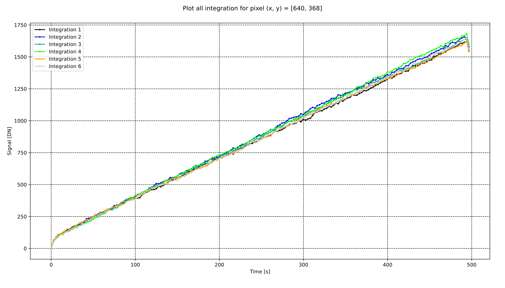
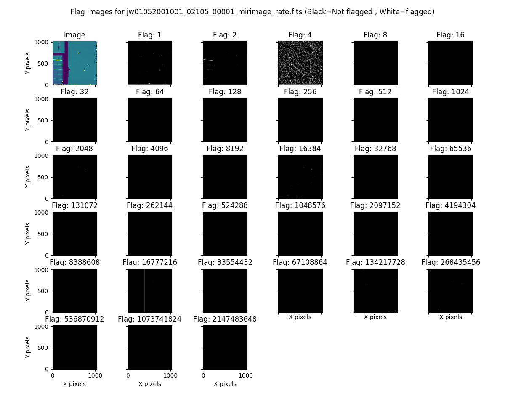
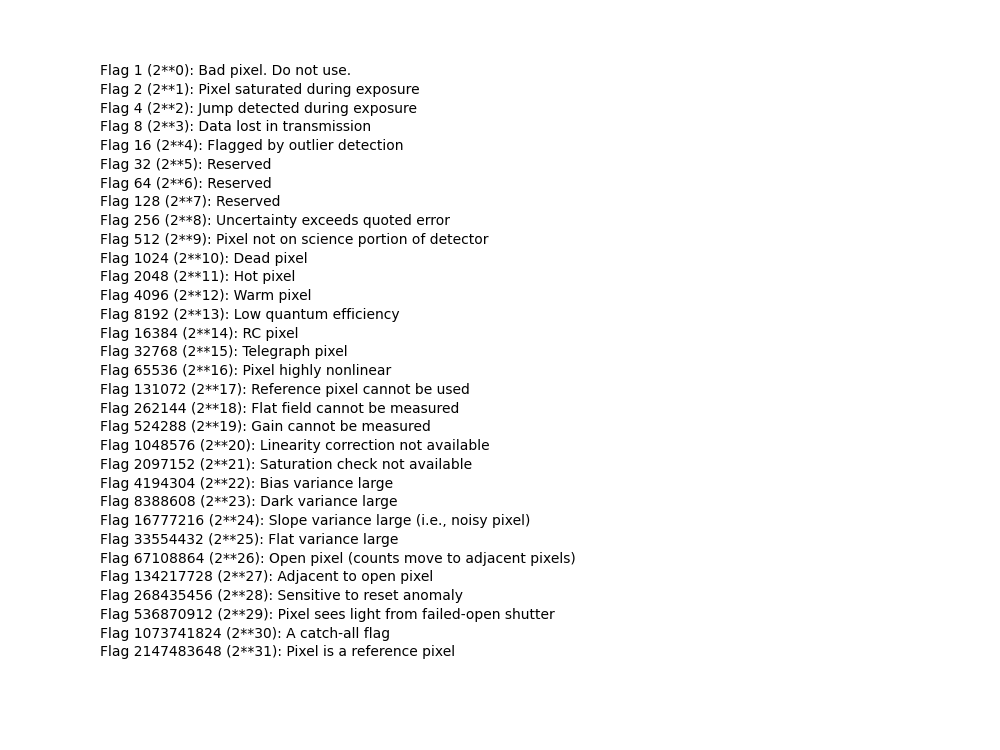

Sub-package
===========================
.. sectnum::

coord
===========
filter_shift
----------------

return colrow shift to transform input filter coordinates into desired filter coordinates

..  code-block:: python

    input_filter = "F560W"
    desired_filter = "F1130W"
    filter_shift(input_filter, desired_filter)

convert_filter_position
-----------------------

return colrow coordinates for the desired filter frame

..  code-block:: python

    input_filter = "F560W"
    desired_filter = "F1130W"
    convert_filter_position((2.5, 4.6), input_filter, desired_filter)

hms2dd
-----------------------
convert ra from hours minutes seconds into decimal degrees

..  code-block:: python

    >>> hms2dd(00, 44, 52.1946)
    11.2174775

dms2dd
-----------------------
convert dec from degree minutes seconds into decimal degrees.

..  code-block:: python

    >>> dms2dd(85, 10, 25.60)
    85.17377777777779

flux
=======
flux2mag
-----------------------
convert flux in mJy into magnitude to the request band assuming this flux correspond to the wref of that band

..  code-block:: python

    mag = flux2mag(flux, band="V", system="Johnson")

mag2flux
-----------------------
convert magnitude in a given band into flux in mJy (associated with the wref of that band)

..  code-block:: python

    flux, wref = mag2flux(mag, band="V", system="Johnson")

extrapolate_flux
-----------------------
given a blackbody temperature, will extrapolate a flux (in mJy) at a given wavelength into
a list of other wavelengths and return an Astropy quantity.

..  code-block:: python

    extr_flux = extrapolate_flux(2, 5.2, 10., 5000) # in_flux, in_wref, out_wave, temperature
    fluxes = extrapolate_flux(2, 5.2, [10, 20], 5000)

photon2jansky
-----------------------
Convert a flux in photon/m2/s/microns to Jy given the associated wavelength

..  code-block:: python

    wave = 10  # microns
    flux = 1509  # photons/m2/s/microns
    f_Jy = photon2jansky(flux, wave)

jansky2photon
-----------------------
Convert a flux in Jy to photon/m2/s/microns given the associated wavelength

..  code-block:: python

    wave = 10  # microns
    flux = 1e-3  # Jy
    f_phot = jansky2photon(flux, wave)

imager
==========
More complex functions not explained on purpose:

* *analyse_aperphot*
* *analyse_box*
* *get_pixel_coordinates*
* *simplified_analyse_box*

abs_to_rel_pixels
-----------------------
Convert pixel coordinate in a sub-array into pixel coordinate in full array imager (given the coordinates and header)

..  code-block:: python

    rel_px = abs_to_rel_pixels(abs_px, header)

crop_image
-----------------------
Resize the first image to match the size of the second. If no header is given, both image will be assumed to start at the lowerleftmost pixel. If headers are given, properties of subarray ill be used to get the box of the second image extracted from the first image.

..  code-block:: python

    cropped_im = crop_image(big_im, small_im, big_header, small_header)

find_array_intersect
------------------------
Given a list of header, will return the coordinates of the box of pixel common to all images (i.e if FULL and Brightsky, will return brightsky coordinates)

..  code-block:: python

    ((xmin, xmax), (ymin, ymax)) = find_array_intersect([header_big, header_medium, header_small])

radial_profile
-----------------------
Compute radial profile on an image, provided function name and center (y, x)

..  code-block:: python

    (y_center, x_center) = (256, 321)
    r, std_profile = radial_profile(image, center=(y_center, x_center), func=np.nanstd)

.. important::
    radius for each bin correspond to the average of the radius of ALL pixel within a bin, meaning the associated radius is not necessarily the center of the bin.

radial_profiles
-----------------------
Compute multiple radial profiles on an image, starting at center (y, x) given in parameter (a default set of functions exist)

..  code-block:: python

    (y_center, x_center) = (256, 321)
    radial_data = radial_profiles(image, center=(y_center, x_center))
    # e.g. radial_data["r"], radial_data["mean"]

.. important::
    radius for each bin correspond to the average of the radius of ALL pixel within a bin, meaning the associated radius is not necessarily the center of the bin.

select_sub_image
-----------------------
Given an image, a center (y, x) and a radius, return a square box centered on *center* with a size of *2 x radius+1*

..  code-block:: python

    sub_image = select_sub_image(big_im, center=(5, 6), radius=3)
    sub_image, (corner_y, corner_x) = select_sub_image(big_im, center=(5, 6), radius=3, corner=True)

subpixel_shift
-----------------------
Given an image and a *dy* and *dx* shift as float, will return the shifted image.

..  code-block:: python

    new_image = subpixel_shift(image, dy, dx)

mask
=========
Data Quality for JWST images is described in the
`JWST pipeline documentation <https://jwst-pipeline.readthedocs.io/en/latest/jwst/references_general/references_general.html#data-quality-flags>`_

change_mask
-----------------------
Force some pixel DQ as visible (and exclude them from the mask). Combined DQ are allowed (value of 5 will consider only the pixel with DQ = 1 and DQ = 4)

..  code-block:: python

    output_mask = change_mask(input_mask, exclude_from_mask=[2])

.. note::

    If a pixel had multiple statuses (e.g 1 and 4) and you remove the status *1* from the mask, that pixel will still be masked because status *4* is still here.

combine_masks
-----------------------
Merge multiple mask into one were a pixel is visible *only* if never masked in all individual masks.

..  code-block:: python

    combined = combine_masks([m1, m2, m3])

decompose_mask_status
--------------------------
Detail the DQ status of a pixel (because a single pixel can have multiple statuses at once ; e.g. noisy and cosmic ray). A parameter can tell if this status comes from JPL or the official datamodel

..  code-block:: python

    result = mask.decompose_mask_status(768)
    >>> print(result)
    [256, 512]

decompose_to_bits
-----------------------
Same as the function before, but return bits instead of flag value:

..  code-block:: python

    result = mask.decompose_to_bits(768)
    >>> print(result)
    [8, 9] # 2^8, 2^9

extract_flag_image
-----------------------
From a full DQ image, will extract only the image of a given flag or combination of flags. Compared to :ref:`get_separated_dq_array`, this also work with flag=5 (i.e pixels that are flagged with 1 and 4 at the same time).

..  code-block:: python

    single_flag = extract_flag_image(mask, 2)

.. _get_separated_dq_array:

get_separated_dq_array
--------------------------
From the original DQ array array(y, x) (that have all flags combined, i.e a  pixel with flag 1 and 4 will have the value 5), will return a cube of individual flag array array(y, x, 32)

..  code-block:: python

    result = mask.get_separated_dq_array(dq_mask)

    saturation_image = result[:, :, 1]  # because saturation flag: 2^1

.. _mask_statistics:

mask_statistic
-----------------------
Given a mask, will tell the different DQ status combination seen, and how many pixels are affected (a threshold can be defined to skip statuses with low number of pixels, by default < 3 pixels)

..  code-block:: python

    print(mask_statistic(mask, min_pix=20))

plot
=======
Compare dither pattern
---------------------------
Usefull to see where are the dither positions (in relative pixel by default, so (0,0) is no dither).

The subtlety lies in the arrow on the line (this is harder to do than it looks in Python), hence why there is a specific function for it.

For each observation in this example. a tuple of 2 lists (dx, dy) is provided

..  code-block:: python

    dithers = [
    ((0.1, 0.2, 0.3, 0.4), (0.1, -0.1, 0.1, -0.1)),
    ((0.2, 0.4, 0.1, 0.3), (-0.1, 0.1, -0.1, 0.1))
    ]

    labels = ["obs1", "obs2"]

    fig = miritools.plot.compare_dithers(dithers, labels=labels)

    Exemple of the *plot.compare_dithers()* function (not representative of the source code example, but gives a better idea of a real example).

histogram
-----------------------
Quickly display an histogram for an input dataset, using optimised number of bins

..  code-block:: python

    import miritools
    import numpy as np

    data = np.random.normal(size=10000)

    fig = miritools.plot.histogram(data, xlabel="Random gaussian")
    # fig2 = histogram(data, xlabel="My data", title="My title")

    Exemple of the *imager.plot.histogram()* function

.. _single_image:

single_image
-----------------------
plot one image with ZScale

..  code-block:: python

    import miritools
    import numpy as np

    image = np.random.random(size=(50, 50))

    fig = miritools.plot.single_image(image, vlabel="Flux [mJy]", title="My plot")
    fig.savefig("single_image.svg")

Optional parameter:

* *force_positive*: If True, will exclude negative values when computing the Zscale

    
    Exemple of the *imager.plot.single_image()* function

.. _MIRI_flag_images:

MIRI_flag_images
-----------------------
Expect list (or one) filenames for a level 2 MIRI imager FITS file, will display the flag image for each file. (e.g. saturation is the flag DQ=2 ; Combined flags also work e.g. 7=4+2+1). The title can be constructed from a header keyword (using the title_keyword parameter), or be provided as a list (using the *titles* parameter, that expect one title per file)

..  code-block:: python

    fig = MIRI_flag_images(filenames, flag=2, title_keyword="NGROUPS")
    fig2 = MIRI_flag_images(filenames, flag=2, titles=["file1", "file2"])

    Exemple of the *imager.plot.MIRI_flag_images()* function

.. _MIRI_saturation_frame:

MIRI_saturation_frame
-------------------------
Given one integration ramp image, return the frame number at which each pixel saturate (as an image).

Default is:

* figure is not saved to file but you can if you define the *filename* keyword
* frame_to_plot is the last one (for the left image used as a reference)
* sat_limit=62000 (at what point the pixel is considered saturated)

..  code-block:: python

    # Normal use
    fig = miritools.plot.MIRI_saturation_frame(ramp_image, filename="saturation.svg")

Mandatory parameters:

* ramp_image as a numpy 3D cube (frame, y, x). Only one integration is accepted, but a cube with an extra 4-th dimension of only one value (1, frame, y, x) will also work.

Optional:

* *frame_to_plot*: Frame used in reference image (left). By default it's the last one
* *sat_limit*: DN count at which the pixel is considered saturated. By default 62000
* *filename*: If given, will save the figure to a file.

.. note::

    That you can do that later since the figure is returned by the function.

    Exemple of the *imager.plot.MIRI_saturation_frame()* function

MIRI_ramp_flag
-----------------------
This function need a ramp image. The subtelty is that you can't use the _uncal format that doesn't have any flag information in it. You have to you the _ramp image that is not saved by default but you can save it manually by reprocessing your data through level 1 with the correct options.

..  code-block:: python

    filename = "jw0xxxx006001_03101_00001-seg000_mirimage_ramp.fits"
    miritools.plot.MIRI_ramp_flag(filename, flag=4)

    Exemple of the *plot.MIRI_ramp_flag()* function

pixel_ramps
-----------------------
Will display all integrations from a pixel in a single level 1b exposure.

..  code-block:: python

    fig = miritools.plot.pixel_ramps(ramp_image=data, metadata=header, pixel=(639, 367),
                                filename="all_ramps.svg", substract_first=True)

    Exemple of the *plot.pixel_ramps()* function

flag_identifier
-----------------------
Introduced in miritools v3.18.0

Will display all individual flag mask of a single exposure (rate or cal) to identify quickly which flag is causing one specific region to be masked.

Another plot is created, for convenience, with a little explanation for each of the individual flag so you don't have to look for it

..  code-block:: python

    filename = 'jw01052001001_02105_00001_mirimage_rate.fits'

    fig = miritools.plot.MIRI_flag_identifier(filename)
    plt.show()

    Exemple of the *plot.flag_identifier()* function

    Exemple of the *plot.flag_identifier()* convenience plot

read
=======

.. important::
    When reading multiple files, the filenames *must* be ordered from oldest to newest file. See :ref:`list_ordered_files`.

MIRI_ramps
-----------------------
Read multiple MIRI ramps

..  code-block:: python

    images, metadatas = read.MIRI_ramps(filenames)

MIRI_exposures
-----------------------
Read multiple MIRI datamodel exposures (_cal, or _rates) (given list of filenames)

..  code-block:: python

    time, images, metadatas = read.MIRI_exposures(filenames, exclude_from_mask=[4])

MIRI_rateints
-----------------------
Read multiple MIRI datamodel integrations (_rateints) (given list of filenames)

..  code-block:: python

    time, images, metadatas = read.MIRI_rateints(filenames, exclude_from_mask=[4])

MIRI_mask_statistics
-----------------------
Given a FITS filename, return the mask statistic of that file (see :ref:`mask_statistics`)

..  code-block:: python

    read.MIRI_mask_statistics(filename)

.. _compare_headers:

compare_headers
-----------------------
Read multiple FITS files and compare headers. In a first part, all keywords whose value is identical for all files are displayed. In a second part, all keywords with varying values are displayed as a nice table. Note that a list of excluded keywords from part II exist by default, and you can overwrite it

..  code-block:: python

    print(read.compare_headers(filenames))

    print(read.compare_headers(filenames, exclude_keywords=["DATE-OBS"]))

An example output::

    Common values:
        ACT_ID: 01
        APERNAME: MIRIM_FULL
        BITPIX: 8
        BKGDTARG: False
        CAL_VCS: RELEASE
        CAL_VER: 0.18.3
        CATEGORY: COM
        CCCSTATE: OPEN
        CRDS_CTX: jwst_0672.pmap
        CRDS_VER: 10.3.1
        CROWDFLD: False
        DATAMODE: 1
        DATAMODL: ImageModel
        DATAPROB: False
        DATE-OBS: 2021-03-12
        DETECTOR: MIRIMAGE
        DRPFRMS1: 0
        DRPFRMS3: 0
        DURATION: 13.875

    Unique values:
    Filename                                            BARTDELT       DVA_DEC        DVA_RA  ENG_QUAL      EXPOSURE    HELIDELT     JWST_DX    JWST_DY    JWST_DZ        JWST_X    JWST_Y    JWST_Z    PATT_NUM    SCTARATE       XOFFSET       YOFFSET
    ------------------------------------------------  ----------  ------------  ------------  ----------  ----------  ----------  ----------  ---------  ---------  ------------  --------  --------  ----------  ----------  ------------  ------------
    679/jw00679001001_02101_00001_mirimage_rate.fits     240.365  -7.02173e-07  -2.27691e-07  OK                   1     239.629  0.00715934  -0.156453  -0.169457  -1.51538e+06   -432472   -324870           1     0        -3.43471e-12  -4.06117e-11
    679/jw00679001001_02101_00002_mirimage_rate.fits     240.366  -7.02174e-07  -2.27691e-07  SUSPECT              2     239.63   0.00715934  -0.156453  -0.169457  -1.51538e+06   -432472   -324870           1     0        -3.43471e-12  -4.06117e-11
    679/jw00679001001_02101_00003_mirimage_rate.fits     240.367  -7.02149e-07  -2.27694e-07  OK                   3     239.631  0.00715984  -0.156448  -0.169453  -1.51537e+06   -432481   -324880           2     0         0.015057     -7.50022e-05

utils
==========
get_exp_time
-----------------------
For a FITS filename, return the start time of the exposure as a time object

..  code-block:: python

    time = get_exp_time(metadata)

.. _mast_reorder:

reorder_miri_input_folder
-----------------------------
(Introduced in v3.10.0)

Given an input folder (relative or absolute path), will search for all .fits file in it, assumed to be JWST MIRI outputs. Will then move them and organize them according to their PID and observation ID. This function is used in CAP104, 202, 501, 502 to ensure the input folder will have the expected structure, no matter how the data is retrieved.

A bash script is automatically created in the input folder *cancel_miri_reorder.sh* to allow you to revert the folder back to its previous state. This file is automatically overwritten by default. Use the option `overwrite=False` if you want the function to stop before moving anything, in case this script already exist.

If you want to test the function without moving anything, you can use the parameter `dryrun=True`.

..  code-block:: python

    import miritools

    miritools.utils.init_log()

    input_folder = "/local/home/ccossou/tmp/MAST_rehearsal_data"

    imlib.utils.reorder_miri_input_folder(input_folder, dryrun=True)
    # imlib.utils.reorder_miri_input_folder(input_folder)

list_files
-----------------------
Given a pattern (using glob) will retrieve a list of FITS filenames, return an error if no files are found (just a wrapper of glob that check if there are matches)

..  code-block:: python

    filenames = list_files("simulations/*_cal.fits")

.. _list_ordered_files:

list_ordered_files
-----------------------
Given a pattern (using glob) will retrieve a list of FITS filenames, then order them from oldest (first) to newest (last)

..  code-block:: python

    filenames = list_ordered_files("simulations/*_cal.fits")
    filenames = list_ordered_files("simulations/*.fits", jpl=True)

lambda_over_d_to_pixels
----------------------------
Compute λ/d in pixel (valid for JWST MIRI Imager) for the given wavelength in microns

..  code-block:: python

    size = lambda_over_d_to_pixels(10)

optimum_nbins
-----------------------
Given a dataset destined to be used in a histogram, will return the apropriated number of bins necessary to view the dataset (assuming you display between min and max of that dataset)

..  code-block:: python

    nbins = optimum_nbins(dataset)
    fig, ax = plt.subplots()
    ax.hist(dataset, bins=nbins, density=True, histtype="step")

timer
-----------------------
Decorator to time how long it takes for a function to run, then display it:

..  code-block:: python

    @miritools.utils.timer
    def my_func():
        continue

init_log
-----------------------
Init logging package. The example below show how to use the extra_config, but a simple call without argument should be enough in most cases:

..  code-block:: python

    extra_config = {"loggers":
            {

                "paramiko":
                {
                        "level": "WARNING",
                    },

                "matplotlib":
                {
                        "level": "WARNING",
                    },

                "astropy":
                {
                        "level": "WARNING",
                    },
            },}

    miritools.utils.init_log(log="miritools.log", stdout_loglevel="INFO", file_loglevel="DEBUG", extra_config=extra_config)

write
==========
write_fits
-----------------------
Function to write an image to a FITS file with or without a header

..  code-block:: python

    write.write_fits(image, "output.fits", header=header)
    write.write_fits(image, "output.fits.gz")

write_jwst_fits
-----------------------
Function to write an image to a FITS file and make it look like a JWST image (i.e header in extension 0 and data in extension 1 called SCI)

..  code-block:: python

    write.write_jwst_fits(image, "output.fits", header=header)
    write.write__jwst_fits(image, "output.fits.gz")

fits_thumbnail
-----------------------
retrieve data from extension 1 (by default) and write it with the same name as the fits file, with extension .jpg (with ZScale)

..  code-block:: python

    write.fits_thumbnail("output.fits")
    write.fits_thumbnail("output.fits", fits_extension=0, ext="png")
    write.fits_thumbnail("output.fits", fits_extension=0, ext="png")

write_thumbnail
-----------------------
write image to file, with ZScale applied

..  code-block:: python

    write.write_thumbnail(image, "output.jpg")

